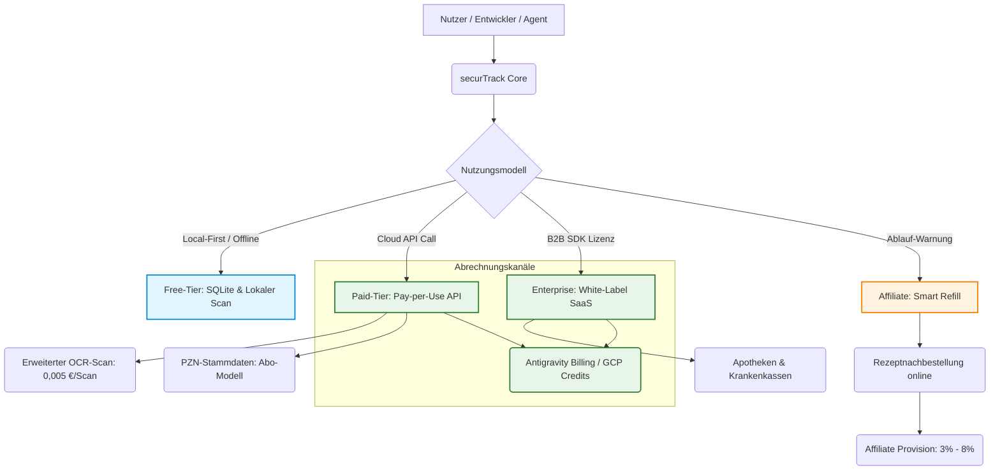
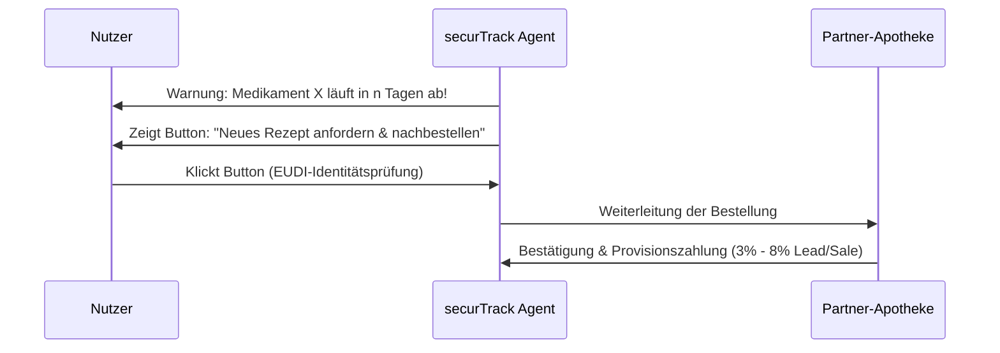

# Monetarisierungsstrategie: securTrack (AuraMed)

Dieses Dokument beschreibt das mehrstufige Geschäftsmodell für den hochspezialisierten Microservice **securTrack** innerhalb des Google Antigravity- und AuraMed-Ökosystems. 

---

## Geschäftsmodell-Architektur

---

## Die 4 Säulen der Monetarisierung

### 1. Das „Open-Core“-Modell (API- & MCP-Freemium)
Um eine schnelle Verbreitung und Entwicklerakzeptanz im Antigravity MCP Store zu erreichen, teilen wir das Angebot in eine kostenlose lokale und eine kostenpflichtige Cloud-Ebene auf.

* **Free-Tier (Local-First):** 
  * Der MCP-Server und das Antigravity-Plugin sind Open-Source.
  * Unbegrenzte lokale Barcode-Scans und Speicherung in einer SQLite-Datenbank.
  * Zielgruppe: Entwickler, Smart-Home-Enthusiasten und datenschutzbewusste Endnutzer.
* **Paid Cloud-Tier (Pay-per-Use API):**
  * **Standard-OCR-Scans:** Cloud-basierte, pharma-optimierte OCR-Erkennung für beschädigte/unleserliche Codes.
    * *Abrechnung:* z. B. 0,005 € pro Scan (nach 100 Freiscans/Monat).
  * **PZN-Stammdaten-Enrichment:** Vollautomatische Auflösung der Pharmazentralnummer (PZN) in Wirkstoffe, Medikamentennamen, Packungsgrößen und Sicherheitswarnungen über lizenzierte pharmazeutische Datenbanken.
    * *Abrechnung:* Abonnement (z. B. 9 €/Monat für Power-User, ab 99 €/Monat für Drittanbieter-Apps).

> [!NOTE]
> Der Datenschutz bleibt gewahrt, da sensible Gesundheitsdaten nur lokal verarbeitet werden und die Cloud-Schnittstelle ausschließlich anonymisierte Produkt-Identifikatoren (wie PZN) verarbeitet.

---

### 2. White-Label-Lizenzierung (B2B SaaS)
Apothekenketten, Online-Apotheken und Krankenversicherungen benötigen digitale Mehrwerte, um Kunden zu binden, scheuen jedoch die Eigenentwicklung der komplexen GS1-Decoderlogik.

* **Das Produkt:** securTrack wird als schlüsselfertiges SDK (Docker-Container oder geschützte Cloud-API) bereitgestellt.
* **Der Mehrwert:** Automatische Entschlüsselung fehleranfälliger Formate (z. B. 00-Tagesregel bei Ablaufdaten).
* **Die Monetarisierung:** Jährliche Lizenzgebühr (Enterprise SaaS), skaliert nach der Anzahl der aktiven Endnutzer der Partner-App (z. B. ab 4.900 €/Jahr für lokale Apotheken-Kooperationen bis hin zu fünfstelligen Beträgen für Großversicherer).

---

### 3. Der „Smart Refill“ Affiliate-Kanal
Dies stellt den größten Hebel im täglichen Endkundenbetrieb dar. Wir monetarisieren die unmittelbare Auswirkung des Ablaufdatums.

* **Vorteil für Apotheken:** Hocheffizienter Traffic mit extrem hoher Conversion-Rate, da der Bedarf unmittelbar gegeben ist.

> [!TIP]
> Die Anbindung über die europäische digitale Identität (EUDI-Wallet) vereinfacht die E-Rezept-Übertragung erheblich und erhöht das Vertrauen der Nutzer.

---

### 4. Enterprise-Abrechnung über Google Cloud & Antigravity Ultra
Unternehmen wie Krankenhäuser oder Pflegeheime nutzen securTrack zur automatisierten Überwachung von Stations-MHDs.

* **Einfache Beschaffung:** Über das Google I/O 2026 Update können Kunden ihre Antigravity-Agenten direkt an bestehende Google Cloud Platform (GCP) Projekte koppeln.
* **GCP-Credits nutzen:** Die Abrechnung von API-Gebühren erfolgt direkt über das GCP-Budget des Unternehmens, wodurch bürokratische Hürden im Einkauf entfallen.

---

## Zusammenfassung der Preismatrix

| Modell | Zielgruppe | Preisstruktur | Kernfunktion |
| :--- | :--- | :--- | :--- |
| **Free-Tier** | Entwickler / Bastler | Kostenlos (Open Source) | Lokaler Scan & SQLite-Datenbank |
| **Cloud OCR** | App-Entwickler | 0,005 € pro Scan | Auslesen beschädigter Codes via Cloud-OCR |
| **PZN-Premium** | Power-User / B2C Apps | 9 € - 99 € / Monat | PZN-Auflösung in Inhaltsstoffe/Warnungen |
| **White-Label SDK** | Apotheken / Versicherer | Ab 4.900 € / Jahr | Eigenständige B2B-Integration |
| **Smart Refill** | Endnutzer / Apotheken | 3% - 8% per Sale | Affiliate-Vermittlung von Nachbestellungen |
